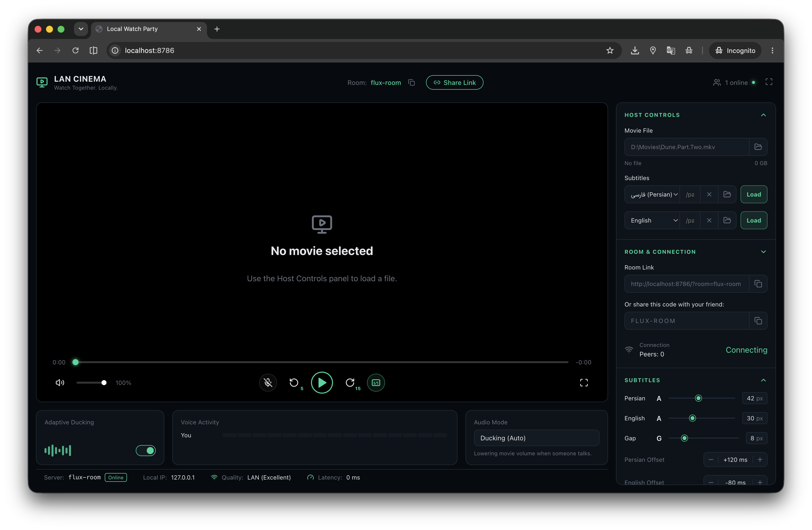

# 🎬 Local Watch Party

> **Watch movies in sync with friends — over your local network or anywhere in the world.**



---

## ✨ What is this?

**Local Watch Party** (aka *LAN Cinema*) is a self-hosted web app that lets you and your friends watch the same movie at the exact same time — perfectly synchronized. The host picks a local video file, and everyone in the room sees every play, pause, and seek in real time.

No accounts. No uploads to the cloud. Just hit run and share a link.

---

## 🚀 Features

- 🎞️ **Synchronized playback** — play, pause, and seek stay in lockstep for all viewers via Socket.IO
- 📡 **LAN & public tunnel mode** — works on your home network, or expose it publicly via a Cloudflare tunnel with one command
- 🔤 **Dual-language subtitles** — load Persian and English `.srt`/`.vtt` files simultaneously with per-language millisecond offset controls and adjustable vertical gap
- 🎙️ **Built-in voice chat** — WebRTC-powered voice with echo cancellation, noise suppression, voice activity detection, and adaptive movie-volume ducking so voices always come through clearly
- 📼 **HLS on-demand transcoding** — FFmpeg converts tricky codecs (MKV, etc.) on the fly for broad browser compatibility
- 📁 **File picker upload** — drag or pick any local video; it streams from your machine to everyone in the room
- 📶 **Live connection status** — see peer count, LAN quality, and latency at a glance

---

## 🖥️ Getting Started

```bash
# Install dependencies
npm install

# Build the frontend
npm run build

# Start the server (default port: 3001)
npm start
```

Open [http://localhost:3001](http://localhost:3001) on the host machine.  
Share the LAN link shown in the app with your friend — for example `http://192.168.x.x:3001/?room=ABC123`.

### 🌍 Public mode (outside your home network)

```bash
npm run build
npm run public
```

A `https://...trycloudflare.com` URL will be printed in the terminal. Share that with anyone anywhere.

---

## 🛠️ Tech Stack

| Layer | Tech |
|---|---|
| Frontend | React 18, Vite |
| Backend | Node.js, Express |
| Real-time sync | Socket.IO |
| Voice chat | WebRTC |
| Video streaming | HTTP byte-range, HLS |
| Transcoding | FFmpeg (via child_process) |
| File uploads | Multer |
| Public tunnel | Cloudflare Tunnel (cloudflared) |

---

## 💡 Tips

- **MP4/H.264/AAC** is the safest format — plays in every browser without transcoding
- If the host hears **duplicate audio**, lower *Remote voice volume* or use headphones
- Each device may need to click **"Enable playback on this device"** once — browsers block remote autoplay with sound until the user interacts
- If macOS asks about firewall access, allow Node to accept local network connections

---

## 📄 License

The original source code and original project materials in this repository are licensed under the [PolyForm Noncommercial License 1.0.0](LICENSE).

You may use, modify, and redistribute them only for noncommercial purposes. Commercial use, selling the project, charging for access, or using it as part of a paid product or service is not permitted.

**Required attribution:** Copyright © Soroush Mohammadi Samani (smSamani). This attribution must remain with every copy, modified version, and redistribution.

Third-party dependencies, datasets, APIs, trademarks, and other materials remain subject to their own licenses and terms.
